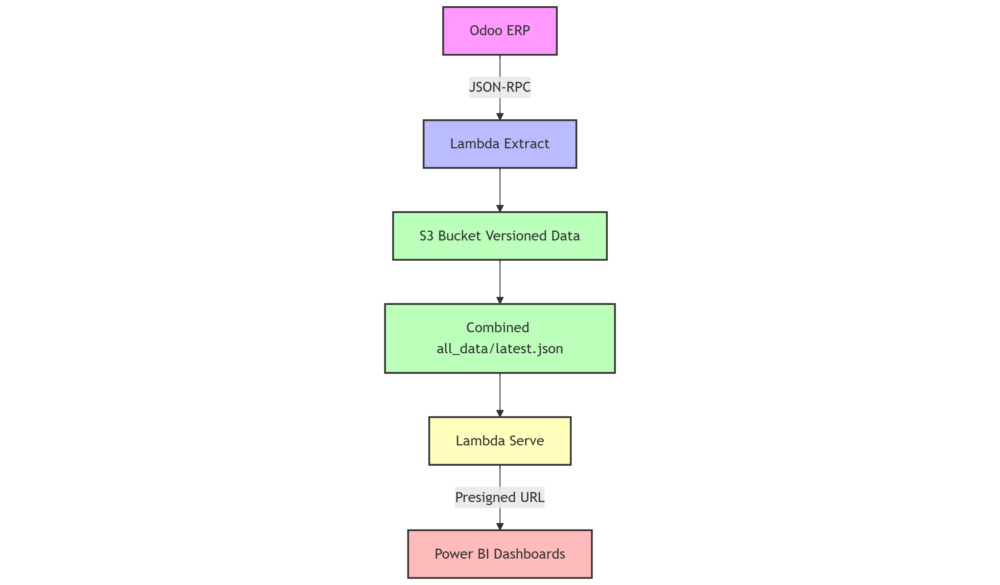

# Odoo ETL Pipeline (Lambda)

[](https://www.python.org/)
[](https://aws.amazon.com/lambda/)
[](https://aws.amazon.com/serverless/)

## Overview

This repository contains a free **serverless ETL pipeline** that integrates **Odoo ERP** with **Power BI** using AWS services. It extracts data from selected Odoo models via **JSON-RPC**, normalizes the data, and loads it into **AWS S3** as versioned datasets. A second Lambda function exposes secure presigned URLs for Power BI, enabling **near real-time reporting** without manual Excel exports.

---

## Features

- Extract data from Odoo ERP via JSON-RPC
- Normalize relational fields and list-based attributes
- Store structured JSON in AWS S3
- Versioned datasets with `latest.json` and timestamped snapshots
- Serve data securely to Power BI via presigned S3 URLs
- Near real-time refresh without manual intervention
- CI/CD deployments via **GitHub Actions** for AWS Lambda

---

## Architecture Diagram



**Data Flow:**

1. **Lambda Extract:** Fetches tables like `projects`, `sale_orders`, `users`, `timesheets`, `invoices`, etc., from Odoo and pushes normalized JSON to S3.
2. **Lambda Serve:** Generates secure presigned URLs for the latest S3 datasets.
3. **Power BI:** Uses the presigned URLs as a data source for near real-time dashboards.

---

## Folder Structure

```
odoo-etl-pipeline-lambda/
│
├── lambda_extract/ # Lambda A: Extract and transform Odoo data
│ ├── app.py
│ ├── requirements.txt
│ └── README.md
│
├── lambda_serve/ # Lambda B: Serve data to Power BI
│ ├── app.py
│ ├── requirements.txt
│ └── README.md
│
├── infra/ # Optional: Infrastructure as Code
│ ├── template.yaml
│ └── README.md
│
├── docs/ # Documentation
│ ├── architecture.md
│ ├── api_endpoints.md
│ ├── powerbi_connection.md
│ └── odoo_models.md
│
├── .github/workflows/
│ └── deploy.yaml # GitHub Actions CI/CD for Lambda
│
├── README.md # This file
└── .gitignore
```

---

## Lambda Environment Variables

| Variable      | Description                         |
|---------------|-------------------------------------|
| `ODOO_URL`    | URL of the Odoo instance            |
| `ODOO_DB`     | Odoo database name                  |
| `ODOO_KEY`   | Odoo account key                       |
| `AWS_REGION`  | AWS region (default: `eu-north-1`) |
| `S3_BUCKET`   | S3 bucket name for storing JSON files |

---

## Setup

### 1. Clone the repository
```bash
git clone https://github.com/<your-username>/odoo-etl-pipeline-lambda.git
cd odoo-etl-pipeline-lambda
```
---

## 2. Install Dependencies

```bash
# Lambda Extract
cd lambda_extract
pip install -r requirements.txt -t .

# Lambda Serve
cd ../lambda_serve
pip install -r requirements.txt -t .
```
## 3. Configure GitHub Actions
```bash
- Go to Settings → Secrets → Actions
- Add AWS_ACCESS_KEY_ID and AWS_SECRET_ACCESS_KEY
```

## 4. Deploy
```bash
- Push to main branch
- GitHub Actions automatically deploys Lambda functions
```


## 5. Usage

### Trigger Lambda Extract (via API Gateway)

```bash
curl -X POST <API_GATEWAY_URL> \
-H "Content-Type: application/json" \
-d '{"table": "projects"}'
```

### Access Data via Lambda Serve (Power BI)
```bash
https://<API_GATEWAY_URL>?table=projects
Response:

{
  "url": "https://s3.amazonaws.com/..."
}
```

## Supported Tables

```bash
- projects
- sale_orders
- invoices
- partners
- users
- timesheets
- project_updates
```

## Contributing

```bash
- Fork the repo
- Create a feature branch: git checkout -b feature/my-feature
- Commit your changes: git commit -m "Add new feature"
- Push: git push origin feature/my-feature
- Open a pull request
```

## License

This project is licensed under the MIT License – see LICENSE
 for details.

## Author
- Rizwan Nisar – Data/AI Engineer
- [LinkedIn](https://www.linkedin.com/in/rizwan-n-12954b147/)
